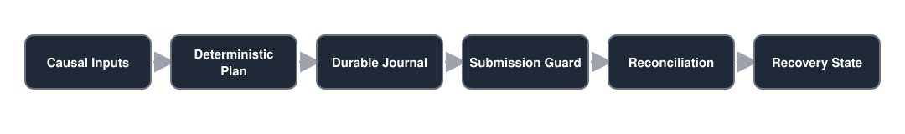

# Trading Execution & Recovery Platform

A **paper/demo-first deterministic execution engine** built to study the difficult part between a frozen trading rule and a broker: durable state, duplicate prevention, reconciliation, crash recovery and fail-closed order submission.

The repository combines two successive internal execution tracks. The historical Python package namespace `sp1execution` and `SP1`/`SP2` contract identifiers are retained deliberately so that the tested lineage remains traceable.

## Highlights

- Durable SQLite decision journal and machine-state transitions.
- Duplicate-decision protection around non-idempotent broker order endpoints.
- Explicit broker reconciliation before and after submission.
- Fail-closed handling of ambiguous submission outcomes.
- Crash/reboot recovery and process-fault testing.
- Deterministic cycle orchestration with serialized submission windows.
- Position normalization and executable-instrument mapping.
- Causal runtime-input compiler and delayed-event dispatcher for recovery logic.
- Trading 212 **demo** adapter and paper-first operational runner.
- Live execution remains disabled by contract.

## Execution pipeline

<p align="center">
  
</p>

## Why this project exists

Backtests usually assume that a decision becomes a clean fill. Real execution systems have to handle much messier questions:

- Was this decision already submitted?
- Did the broker receive a request before the client timed out?
- Does local state agree with broker positions and pending orders?
- What happens if the process dies between persistence and submission?
- Can a reboot replay the same event without duplicating an order?
- Which state is authoritative after a partial or ambiguous workflow?

This project makes those failure modes first-class engineering problems.

## Safety model

The public release is intentionally **demo/paper oriented**.

- Real API keys are never committed.
- `.env.example` contains empty placeholders only.
- Live execution is hard-disabled in the frozen contracts.
- The order path requires explicit environment and execution authorization.
- Ambiguous submission outcomes fail closed instead of being retried blindly.
- Durable decision identity is checked before new broker submission.
- Reconciliation is part of the workflow rather than an afterthought.

No real broker order IDs, account balances or private execution evidence are included in this public release.

## Architecture

The codebase is split into explicit boundaries:

```text
src/sp1execution/
  broker/          broker history, instrument mapping and API adapter
  engine/          planning, membership, capital and reconciliation
  execution/       guarded execution, cycle orchestration and recovery
  market_data/     paper/demo market and holdings providers
  recovery/        causal recovery compiler, durable dispatcher and state
  state/           SQLite journal and deterministic state transitions
  strategy/        frozen strategy semantics

tests/             unit, concurrency, recovery and process-fault tests
contracts/         execution and recovery protocol freezes
ops/systemd/       demo forward-run service/timer definitions
scripts/           operational demo runner
```

See [Architecture](docs/ARCHITECTURE.md) for the component-level flow.

## Historical lineage

The public repository is named generically, while the package remains `sp1execution`.

That mismatch is intentional: renaming the internal namespace would rewrite a tested historical interface solely for presentation. The original execution track was later extended with additive recovery components; the current public snapshot is the superset.

See [Historical lineage](docs/HISTORICAL_LINEAGE.md).

## Installation

Python 3.12+ is required.

```bash
python3 -m venv .venv
source .venv/bin/activate
python -m pip install --upgrade pip
python -m pip install -e .
python -m unittest discover -s tests -v
```

Optional development dependencies provide `pytest` and `ruff`.

## Demo configuration

Copy the example environment and provide your own **demo** credentials locally:

```bash
cp .env.example .env
```

The committed template keeps credential values empty and keeps live trading disabled.

The command-line entry point remains:

```bash
sp1exec doctor
```

The historical CLI name is preserved for compatibility with the frozen package lineage.

## Research fixtures

`contracts/research/` contains compact frozen rule/schedule fixtures required by deterministic recovery tests. These are research provenance artifacts, not broker account evidence and not live runtime authority.

Historical performance values should not be interpreted as a claim of persistent future edge.

## Public release boundary

The release excludes:

- broker order IDs and fill evidence;
- personal/demo account balances and position snapshots;
- real API keys or secrets;
- runtime SQLite state and caches;
- log output and private operational evidence.

See [Publication boundary](docs/PUBLICATION_BOUNDARY.md).

## Project status

This is an execution-engineering research project, not a production brokerage service. It does not send live orders in its published configuration and it makes no claim that the underlying strategy is a deployable or persistent trading edge.

## License

The software and original documentation in this repository are licensed under the [MIT License](LICENSE).

Third-party broker APIs, market data, provider materials, trademarks and other third-party materials are not covered by this license and remain subject to their respective terms.

## Disclaimer

Independent software/research project. It is not affiliated with or endorsed by Trading 212 or any market-data provider referenced by the code.
